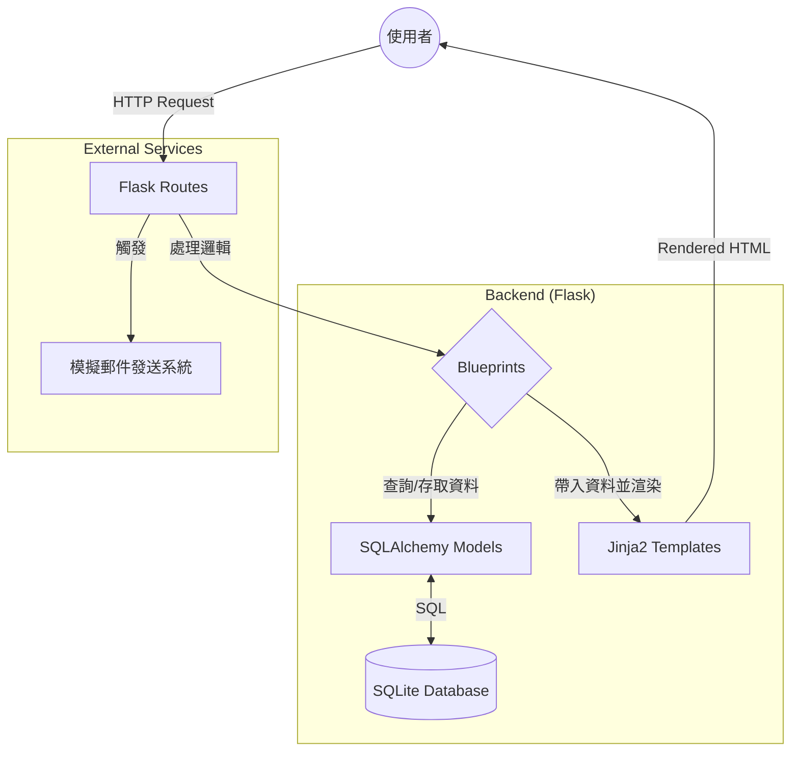

# 系統架構設計 (ARCHITECTURE)

本文件描述「活動報名系統」的技術架構、資料結構與開發規範，旨在引導開發團隊理解系統運作機制。

## 1. 技術架構說明

本系統採用 **Flask** 作為核心後端框架，並遵循傳統的 **MVC (Model-View-Controller)** 模式進行開發。

### 技術選型
- **Backend**: Python + Flask (輕量、靈活，適合快速迭代)
- **Database**: SQLite + Flask-SQLAlchemy (ORM 模式，簡化資料操作)
- **Template Engine**: Jinja2 (負責伺服器端 HTML 渲染，動態產生活動頁面)
- **Frontend Styling**: Vanilla CSS (保持頁面輕量化與高效能)

### MVC 模式職責分配
- **Model (模型)**: 定義資料庫 Schema（如：活動、參與者、使用者、票券），負責資料存取邏輯。
- **View (視圖)**: 使用 Jinja2 模板渲染 HTML，展示給使用者的最終介面。
- **Controller (控制器)**: 透過 Flask 路由 (Routes) 處理請求 (Request)，處理商業邏輯，並決定回傳哪個 View 或導向哪個頁面。

---

## 2. 專案資料夾結構

專案將採取模組化結構，並使用 Flask Blueprints 來確保程式碼的可維護性。

```text
web_app_development/
├── app/
│   ├── models/            # 資料庫模型 (Models)
│   │   ├── __init__.py
│   │   ├── activity.py    # 活動相關模型
│   │   └── registration.py # 報名相關模型
│   ├── routes/            # Flask 路由 (Controllers)
│   │   ├── __init__.py
│   │   ├── main.py        # 首頁與公開活動頁面
│   │   ├── admin.py       # 主辦方管理後台
│   │   └── api.py         # 異步請求 API
│   ├── templates/         # Jinja2 模板 (Views)
│   │   ├── base.html      # 基礎框架
│   │   ├── index.html     # 首頁
│   │   ├── admin/         # 管理端頁面
│   │   └── registration/  # 報名與票券頁面
│   ├── static/            # 靜態資源
│   │   ├── css/
│   │   ├── js/
│   │   └── img/
│   └── utils/             # 工具程式 (Email, QR Code)
├── instance/
│   └── database.db        # SQLite 資料庫檔案
├── docs/                  # 文件
│   ├── PRD.md
│   └── ARCHITECTURE.md
├── .env                   # 環境變數
├── requirements.txt       # 套件清單
├── config.py              # 系統設定
└── app.py                 # 應用程式入口
```

---

## 3. 元件關係圖

以下展示了使用者從瀏覽器發送請求到系統回傳結果的完整流程：



---

## 4. 關鍵設計決策

### 1. 使用 Flask-SQLAlchemy (ORM)
**決策原因**：避免直接撰寫 SQL 語句，降低開發錯誤並提升程式碼可讀性。同時方便未來若需遷移至 MySQL 或 PostgreSQL 等大型資料庫時，只需更改設定檔。

### 2. 資料夾模組化 (Blueprints)
**決策原因**：將「大眾瀏覽、主辦方管理、後台 API」功能拆分到不同的路由檔案中。這對於多人協作與功能擴建至關重要，能避免 `app.py` 變得過於龐大。

### 3. 靜態資源與模板分離
**決策原因**：嚴格區分 `static` 與 `templates`，並在 `base.html` 中統籌 CSS/JS 的引用，確保所有頁面的視覺風格一致且易於修改。

### 4. 模擬通知系統
**決策原因**：針對 MVP 階段，將優先實作「模擬通知」邏輯（例如在 Console 輸出或存入模擬日誌），待核心報名流程驗證後再串接 SendGrid 或 SMTP。

---

## 5. 擴充建議

- **安全性**：後續需引入 Flask-Login 實作主辦方登入機制。
- **異步處理**：若活動報名量極大，可考慮引入 Celery 處理郵件發送作業。
- **快取**：對於不常變動的活動詳情頁面，可使用 Flask-Caching 優化效能。
