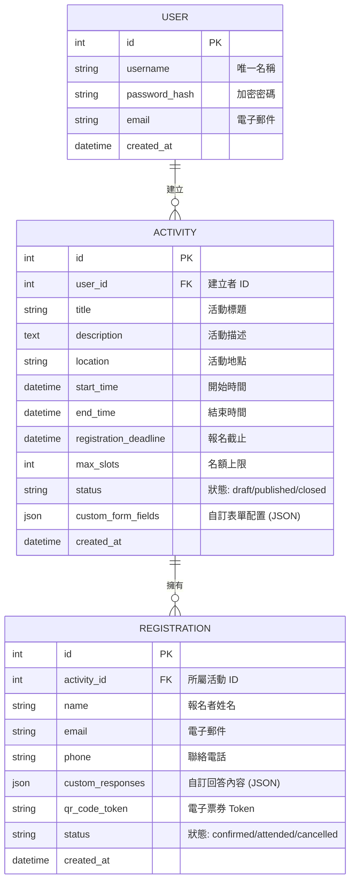

# 資料庫設計 (DATABASE DESIGN)

本文件定義本系統的資料庫結構，包含實體關係圖 (ER Diagram)、詳細欄位說明及 SQL 建表語法。本系統選用 **SQLite** 作為資料庫儲存引擎。

## 1. 實體關係圖 (ER Diagram)

本系統包含三個核心實體：**User (管理者)**、**Activity (活動)** 與 **Registration (報名紀錄)**。

---

## 2. 資料表詳細說明

### 2.1 User (管理者)
| 欄位 | 型別 | 說明 | 必填 |
| :--- | :--- | :--- | :--- |
| id | INTEGER | PK, 自動增量 | 是 |
| username | TEXT | 管理員登入帳號（唯一） | 是 |
| password_hash | TEXT | 經過雜湊處理的密碼 | 是 |
| email | TEXT | 聯絡 Email | 否 |
| created_at | DATETIME | 建立時間 | 是 |

### 2.2 Activity (活動)
| 欄位 | 型別 | 說明 | 必填 |
| :--- | :--- | :--- | :--- |
| id | INTEGER | PK, 自動增量 | 是 |
| user_id | INTEGER | FK -> User.id | 是 |
| title | TEXT | 活動名稱 | 是 |
| description | TEXT | 活動細節說明 | 否 |
| location | TEXT | 地的地點 | 否 |
| start_time | DATETIME | 活動開始時間 | 是 |
| end_time | DATETIME | 活動結束時間 | 是 |
| registration_deadline | DATETIME | 報名截止時間 | 是 |
| max_slots | INTEGER | 最大名額上限（0 表示不限） | 是 |
| status | TEXT | `draft` (草稿), `published` (發布), `closed` (關閉) | 是 |
| custom_form_fields | TEXT (JSON) | 定義表單欄位（如：[{"label": "尺寸", "type": "select", "options": ["S", "M", "L"]}]） | 否 |
| created_at | DATETIME | 建立日期 | 是 |

### 2.3 Registration (報名紀錄)
| 欄位 | 型別 | 說明 | 必填 |
| :--- | :--- | :--- | :--- |
| id | INTEGER | PK, 自動增量 | 是 |
| activity_id | INTEGER | FK -> Activity.id | 是 |
| name | TEXT | 報名者姓名 | 是 |
| email | TEXT | 報名者 Email | 是 |
| phone | TEXT | 報名者電話 | 否 |
| custom_responses | TEXT (JSON) | 儲存自訂欄位的回答（格式：{"尺寸": "M", "飲食": "蛋奶素"}） | 否 |
| qr_code_token | TEXT | 用於核銷的唯一 Token | 是 |
| status | TEXT | `confirmed` (已確認), `attended` (已簽到), `cancelled` (已取消) | 是 |
| created_at | DATETIME | 報名日期 | 是 |

---

## 3. 關鍵設計選擇

- **JSON 擴充性**：活動表單往往有不同的資訊收集需求，使用 JSON 欄位可避免因新增欄位而頻繁修改 Schema，適合輕量快速開發。
- **Token 簽到機制**：`qr_code_token` 為獨立於 ID 的隨機字串，可用於產生 QR Code 並在現場簽到時進行快速檢索。
- **身分隔離**：透過 `user_id` 確保每位主辦方僅能管理自己的活動資料。
