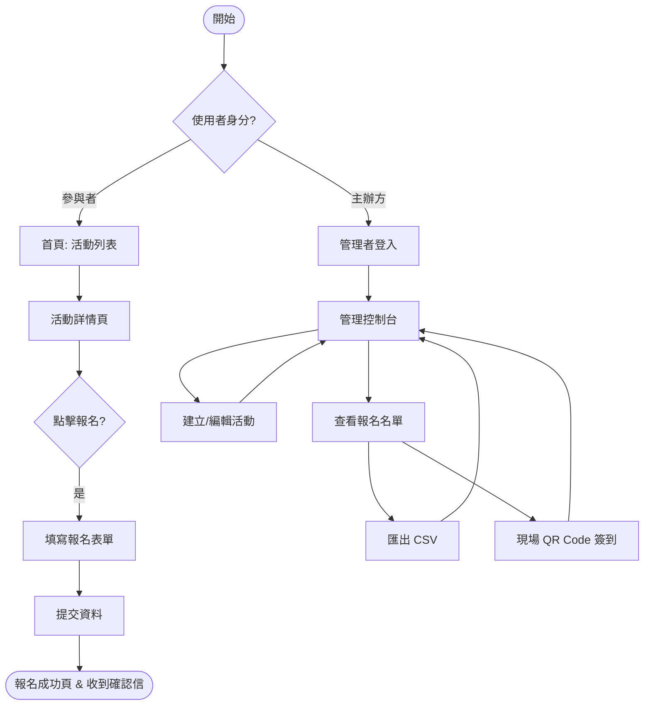
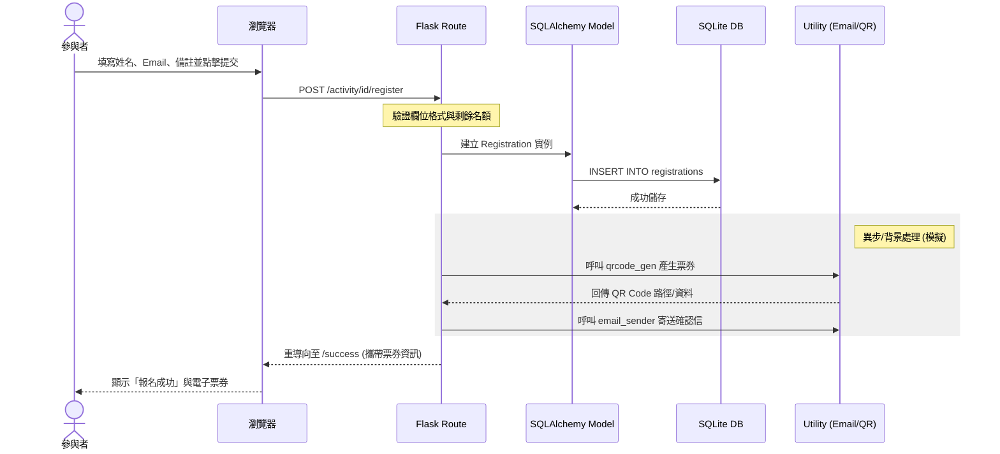

# 系統流程圖 (FLOWCHART)

本文件使用 Mermaid 語法定義活動報名系統的操作流程與資料流向，幫助開發人員理解功能邏輯。

## 1. 使用者流程圖 (User Flow)

描述「參與者」與「主辦方」在系統中的主要操作路徑。

---

## 2. 系統序列圖 (Sequence Diagram)

以「參與者提交報名表單」為例，展示系統內部元件的互動過程。

---

## 3. 功能路徑對照表

以下為系統核心功能與對應的路由配置參考：

| 功能區域 | 功能名稱 | 建議 URL 路徑 | 方法 | 說明 |
| :--- | :--- | :--- | :--- | :--- |
| **公開頁面** | 首頁 (活動列表) | `/` | GET | 展示所有進行中的活動 |
| | 活動詳情頁 | `/activity/<int:id>` | GET | 顯示活動說明、時間、剩餘名額 |
| | 提交報名 | `/activity/<int:id>/register` | POST | 接收報名資料並儲存 |
| | 報名成功頁 | `/registration/success` | GET | 顯示成功訊息與 QR Code |
| **管理後台** | 管理者登入 | `/admin/login` | GET/POST | 主辦身份驗證 |
| | 管理者控制台 | `/admin/dashboard` | GET | 活動清單管理與數據概覽 |
| | 建立活動 | `/admin/activity/new` | GET/POST | 設定活動標題、時間、報名規則 |
| | 名單管理 | `/admin/activity/<int:id>/list` | GET | 該活動的參與者詳細清單 |
| | 資料匯出 | `/admin/activity/<int:id>/export` | GET | 下載報名名單 CSV |

---

## 4. 流程設計決策說明

1.  **分流設計**：首頁作為大門，明確區分一般使用者瀏覽與管理端進入點，確保動線清晰。
2.  **即時驗證**：在序列圖中強調了 Flask Route 的驗證步驟，確保進入資料庫前的資料品質。
3.  **確認通知流程**：將郵件與 QR Code 產生視為報名成功後的「副作用」串接，確保使用者能在最短時間內看到成功頁面。
4.  **管理路徑閉環**：主辦方在執行完單一管理任務（如匯出）後，引導回到 Dashboard，維持一致的後台操作邏輯。
